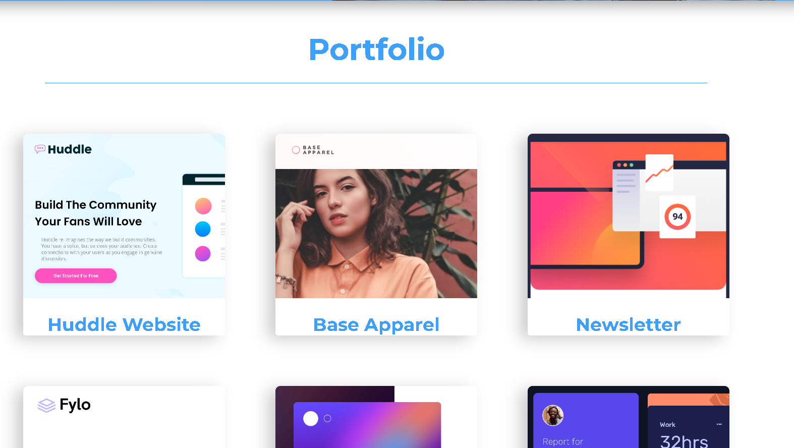

# Portfolio Website

This is a portfolio website showcasing the my projects and information.

## Table of Contents
- [Description](#description)
- [Installation](#installation)
- [Usage](#usage)
- [Contact](#contact)

## Description

This website serves as a platform to present my projects and skills. It includes sections for projects, an about me section, and contact information.

## Installation

There are no specific installation steps required for this website. Simply clone the repository or download the code files to your local machine.

## Usage

To use the website, open the `index.html` file in a web browser. The website is designed to be responsive and can be viewed on different devices and screen sizes.

## Contact

For any inquiries or collaborations, feel free to reach out to Fernando De La Torre through the following channels:
- Email: [ferchodlt1971@gmail.com](mailto:ferchodlt1971@gmail.com)
- LinkedIn: [Fernando De La Torre](https://www.linkedin.com/in/fernando-de-la-torre-3504669b)
- GitHub: [FernandoDLT](https://github.com/FernandoDLT)

---

*Note: This README.md file provides a basic template and can be customized according to your specific needs and preferences.*
